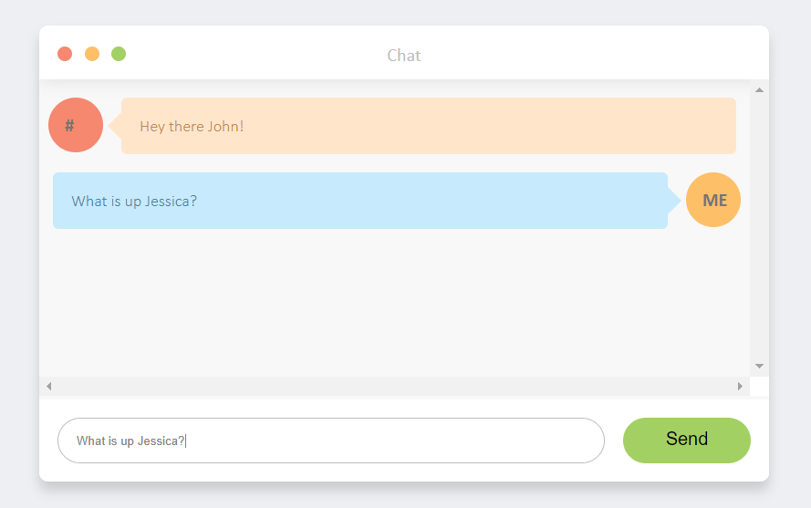

# Simple Web Chat with Socket.io and Node.JS

Demonstrating sockets with a simple web chat application



## Getting Started

These instructions will get you a copy of the project up and running on your local machine for development and testing purposes. .

### Prerequisites

```
Node.Js
```

### Installing


```
Open up a command line and clone this repository ( git clone https://github.com/lumbytyci/chat-web-socket.io )
```

After cloning navigate to the repository-folder you cloned:
```
cd chat-web-socket.io
```
Install the necessary dependencies:
```
npm install
```


## Built With

* [Node.Js](https://nodejs.org/en/) - Backend

## Authors

* **Lumi Bytyçi** 
